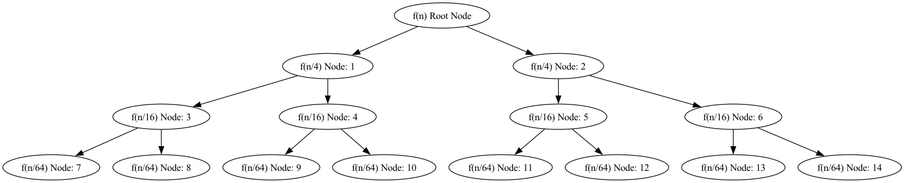

# INTELLIGO

## Complexity Theory Tool 
_A web app to aid in understanding of asymptotic complexity theory, for my undergraduate honours project._
Built and deployed with `Django`, `Python`, `Bootstrap` \& `PythonAnywhere`.

#### Check it out here: https://intelligo.pythonanywhere.com

## Overview
Web app built for visualizing and learning about discrete maths, which gives thorough solutions to problems using asymptotic notation and graphs.
User may enter an equation for `f(n)`, which will generate the `big-O` & `big-Omega` solutions using the limit as n grows to infty of `f(n)/g(n)`.
Alternatively, user may enter a for divide-and-conquer recurrence, `T(n)`, which will generate the asymptotic analysis using the Master's Method.
To complement the output of the Master's Method, the corresponding recursion tree for `T(n)` is generated dynamically, as a visual learning aid for the user.

## Running Locally

To install requirements run, 

`pip3 install requirements.txt`

Then to launch the site,

`python3 manage.py runserver`

## Development

- Python3 for mathematics backend-logic layer
- Django Python Web framework for Model and View
- Bootstrap for frontend (UI layer)
- `graphviz` python library for recursion tree visualization
- `numpy` and `sympy` for computing calculus
- Tested in Brave and Chrome browsers
- Deployed with PythonAnywhere and SQLite

## Challenges
Deploying was not possible with the original implementation of the tree using `graphviz`. It's a powerful tool for rendering graphical diagrams, including trees. However, it needs to be installed on the system running your code. This can make it difficult to use on some platforms. Below is an example of a tree rendered with the `graphviz` implementation originally used:



**Solution:** To work with the Railway deployment the tree is now rendered using `anytree`. Below is an example of the current implementation.

```plaintext
f(n) Root Node
├── f(n/3) Node: 1
│   ├── f(n/9) Node: 3
│   │   ├── f(n/27) Node: 7
│   │   └── f(n/27) Node: 8
│   └── f(n/9) Node: 4
│       ├── f(n/27) Node: 9
│       └── f(n/27) Node: 10
└── f(n/3) Node: 2
    ├── f(n/9) Node: 5
    │   ├── f(n/27) Node: 11
    │   └── f(n/27) Node: 12
    └── f(n/9) Node: 6
        ├── f(n/27) Node: 13
        └── f(n/27) Node: 14
```

